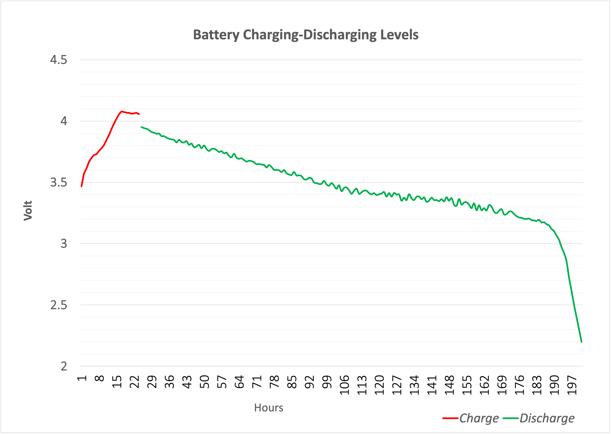
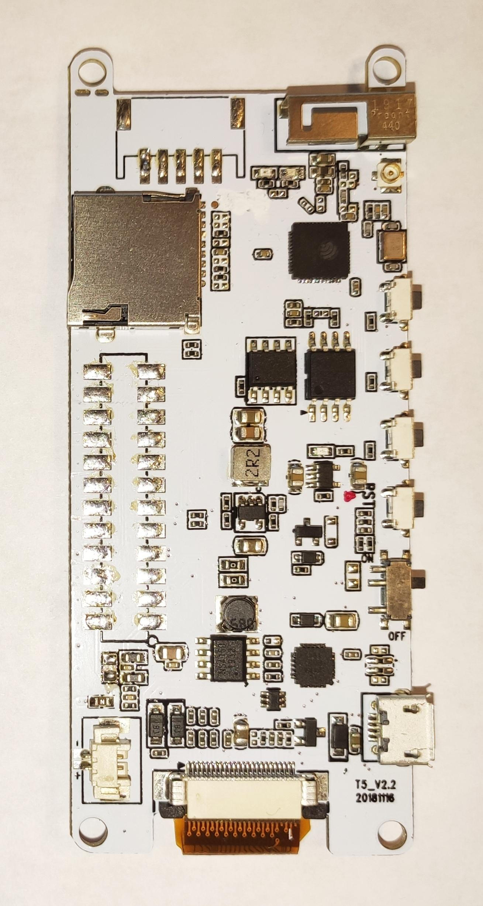

## PHP Internet Clock Projetc

Links to manufaturers of components:

Main module: http://www.lilygo.cn/prod_view.aspx?TypeId=50031&Id=1146&FId=t3:50031:3

EP Display: https://www.good-display.com/product/360.html

Project Box: https://www.hammfg.com/part/1591ATCL

Other components:

- Battery: 3.7V,4000mAH 104080 Li-ion
- Speaker: 8Ω 1W 25x16x6.4mm
- LEDs: 7pcs SMD 0402 blue 
- QI wireless charging (receiver) module

### Future plans to add:

- external WiFi antenna
- speaker vol control
- on/off switch

### Battery Discharge curve

### Back side of the module

